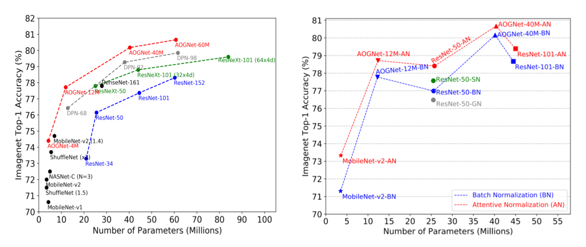

# AOGNet-v2

**Please check our refactorized code at [iVMCL-Release](https://github.com/iVMCL/iVMCL-Release).**

This project provides source code for [AOGNets: Compositional Grammatical Architectures for Deep Learning
](https://arxiv.org/abs/1711.05847)(CVPR 2019) and [Attentive Normalization](https://arxiv.org/abs/1908.01259).



## Installation

1. Create a conda environment, and install all dependencies.
```
conda create -n aognet-v2 python=3.7
conda activate aognet-v2
git clone https://github.com/iVMCL/AOGNet-v2
cd AOGNet-v2
pip install -r requirements.txt
```
2. Install PyTorch 1.0+, follows [https://pytorch.org/](https://pytorch.org/)

3. Install apex, follows [https://github.com/NVIDIA/apex](https://github.com/NVIDIA/apex)


## ImageNet dataset preparation

- Download the [ImageNet dataset](http://image-net.org/download) to YOUR_IMAGENET_PATH and move validation images to labeled subfolders
    - The [script](https://raw.githubusercontent.com/soumith/imagenetloader.torch/master/valprep.sh) may be helpful.

- Create a datasets subfolder under your cloned AOGNet-v2 and a symbolic link to the ImageNet dataset

```
$ cd AOGNet-v2
$ mkdir datasets
$ ln -s PATH_TO_YOUR_IMAGENET ./datasets/
```

## Pretrained models for Evaluation

```
$ cd AOGNet-v2
mkdir pretrained_models
```
Download pretrained models from the links provided in the tables below, unzip it and place into the pretrained_models directory.
```
$ ./scripts/test_fp16.sh <pretrained model directory path>
```

- Models trained with normal training setup: 120 epochs, cosine lr scheduling, SGD, ... (MobileNet-v2 trained with 150 epochs). All models are trained with 8 Nvidia V100 GPUs. 

| Method | #Params | FLOPS | top-1 error (%) | top-5 error (%)| Link |
|---|---|---|---|---|---|
| ResNet-50-BN | 25.56M | 4.09G | 23.01 | 6.68 | [Google Drive](https://drive.google.com/open?id=1NqGbN5XjEWufq-V3WXz0eXJ2HKDL2wGV) |
| ResNet-50-GN* | 25.56M | 4.09G | 23.52 | 6.85 | - |
| ResNet-50-SN* | 25.56M | - | 22.43 | 6.35 | - |
| ResNet-50-SE* | 28.09M | - | 22.37 | 6.36 | - |
| ResNet-50-AN (w/ BN) | 25.76M | 4.09G | 21.59 | 5.88 | [Google Drive](https://drive.google.com/open?id=17MNrFTBJS__1cW6PNcLS1lJ7590QyA6m) |
| ResNet-101-BN | 44.57M | 8.12G | 21.33 | 5.85 | [Google Drive](https://drive.google.com/open?id=1txeVNkDDKd45dIrJAZyW6Si1UgGvqtXu)|
| ResNet-101-AN (w/ BN) | 45.00M | 8.12G | 20.61 | 5.41 |[Google Drive](https://drive.google.com/open?id=1Cq-D2Gm2QeZW2WqfCrSeqou4AhYqH9yN) |
| MobileNet-v2-BN | 3.50M | 0.34G | 28.69 | 9.33 | [Google Drive]()|
| MobileNet-v2-AN (w/ BN) | 3.56M | 0.34G | 26.67 | 8.56 | [Google Drive](https://drive.google.com/open?id=1pD-fHdzyVW5ufC8FB4R7yPtjN4Z2St4t)|
| AOGNet-12M-BN | 12.26M | 2.19G | 22.22 | 6.06 | [Google Drive](https://drive.google.com/open?id=1PsA2EvEw7wsCGhzp65Lfq3w1pvkU65o0) |
| AOGNet-12M-AN (w/ BN) | 12.37M | 2.19G | 21.28 | 5.76 | [Google Drive](https://drive.google.com/open?id=1t4Oa0vZuakNfR-PWhMIiOWsVTCZ8Z-G-) |
| AOGNet-40M-BN | 40.15M | 7.51G | 19.84 | 4.94 | [Google Drive](https://drive.google.com/open?id=1u-ToLniZVEkBlbSGQL49A3V72cXS5Dwd) |
| AOGNet-40M-AN (w/ BN) | 40.39M | 7.51G | 19.33 | 4.72 | [Google Drive](https://drive.google.com/open?id=1LWvdhjxQ259_Gq-YMNT70fAraDGsIWKo) |

\* From original paper

- Models trained with advanced training setup: 200 epochs, 0.1 label smoothing, 0.2 mixup

| Method | #Params | FLOPS | top-1 error (%) | top-5 error (%)| Link |
|---|---|---|---|---|---|
| ResNet-50-BN | 25.56M | 4.09G | 21.08 | 5.56 | [Google Drive](https://drive.google.com/open?id=1SoE0U9W5ghpEhmCCYqClq9Io1WkZts_C) |
| ResNet-50-AN (w/ BN) | 25.76M | 4.09G | 19.92 | 5.04 | [Google Drive](https://drive.google.com/open?id=1qWSN-95Blq-MBCFCzh1DpmmB7kk9VHbU) |
| ResNet-101-BN | 44.57M | 8.12G | 19.71 | 4.89 | [Google Drive](https://drive.google.com/open?id=1oqPQG7Oc0REvrLABAjsrmOpP4GdGgXEG)|
| ResNet-101-AN (w/ BN) | 45.00M | 8.12G | 18.85 | 4.63 |[Google Drive](https://drive.google.com/open?id=1habUSoSotE8-fEq60IhnR2CjYM14wssv) |
| AOGNet-12M-BN | 12.26M | 2.19G | 21.63 | 5.60 | [Google Drive](https://drive.google.com/open?id=14gZ18L4mqHWI79P3d-gY01jqqGVsA9hB) |
| AOGNet-12M-AN (w/ BN) | 12.37M | 2.19G | 20.57 | 5.38 | [Google Drive](https://drive.google.com/open?id=1GY6TbanFrXSBcFD-kjmBixf4wG2Vp1sJ) |
| AOGNet-40M-BN | 40.15M | 7.51G | 18.70 | 4.47 | [Google Drive](https://drive.google.com/open?id=1MugHc_9rn5wR7d1Hyx4oaGjc64l8v_aG) |
| AOGNet-40M-AN (w/ BN) | 40.39M | 7.51G | 18.13 | 4.26 | [Google Drive](https://drive.google.com/open?id=1w5W12mDgni0DPCANuvPoIbmKKPND-Kdh) |

- Remarks: The accuracy from the pretrained models might be slightly different than that reported during the training (used in our papers). The reason is still unclear.


## Perform training on ImageNet dataset

```
$ cd AOGNet-v2
$ ./scripts/train_fp16.sh <config_fie>
```

e.g. For training AOGNet-12M with AN 
```
$ ./scripts/train_fp16.sh configs/aognet-12m-an-imagenet.yaml
```

See more configuration files in [configs](https://github.com/iVMCL/AOGNet-v2/tree/master/configs). Change the GPU settings in scripts/train_fp16.sh


## Object Detection and Instance Segmentation on COCO
We performed object detection and instance segmentation task on COCO with our models pretrained on ImageNet. We implement it based on the [mmdetection](https://github.com/open-mmlab/mmdetection) framework. The code is released in [https://github.com/iVMCL/AttentiveNorm_Detection/tree/master/configs/attn_norm](https://github.com/iVMCL/AttentiveNorm_Detection/tree/master/configs/attn_norm).

## Citations
Please consider citing the AOGNets or Attentive Normalization papers in your publications if it helps your research.
```
@inproceedings{li2019aognets,
  title={AOGNets: Compositional Grammatical Architectures for Deep Learning},
  author={Li, Xilai and Song, Xi and Wu, Tianfu},
  booktitle={Proceedings of the IEEE Conference on Computer Vision and Pattern Recognition},
  pages={6220--6230},
  year={2019}
}

@article{li2019attentive,
  title={Attentive Normalization},
  author={Li, Xilai and Sun, Wei and Wu, Tianfu},
  journal={arXiv preprint arXiv:1908.01259},
  year={2019}
}
```

## Contact

Please feel free to report issues and any related problems to Xilai Li (xli47 at ncsu dot edu), and Tianfu Wu (twu19 at ncsu dot edu).

## License

AOGNets related codes are under [RESEARCH ONLY LICENSE](./LICENSE).
